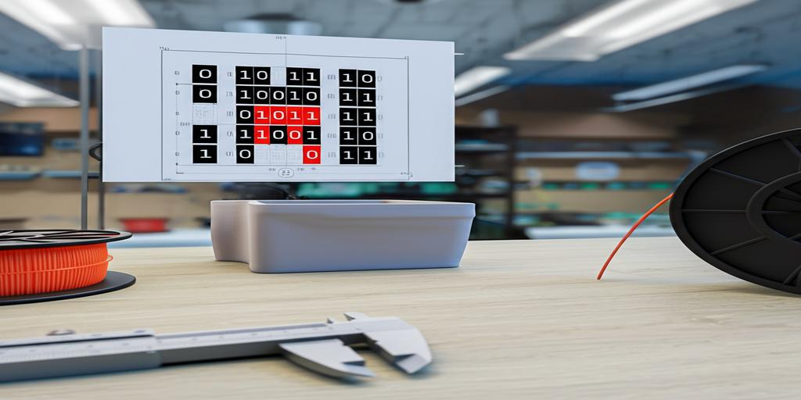

# Gridfinity Bin Generator

[](banner.jpg)

## Purpose

This script generates custom Gridfinity bin STL files based on a specified shape. You can define the bin's footprint using either a rectangular grid size or a custom binary matrix representation. The script allows you to specify the height of the bin in Gridfinity units.

## Installation

1.  Ensure you have Python 3 installed.
2.  Install the required dependencies:
    ```bash
    pip install build123d gfthings
    ```

## Usage

```bash
./gridfinity_bin.py [shape] --height [height_units]
```

**Arguments:**

*   `shape`:  Defines the bin's footprint. Can be:
    *   Two integers:  Specifies the number of columns and rows for a rectangular bin (e.g., `3 2` for a 3x2 bin).
    *   Binary matrix as row strings: Defines a custom shape where `1` represents a cell and `0` represents empty space (e.g., `111 101 111`).
*   `--height`: (Optional) Specifies the height of the bin in Gridfinity units. Defaults to 3.

## Examples

**1. Generate a 3x2 bin with a height of 4 units:**

```bash
./gridfinity_bin.py 3 2 --height 4
```

This will create a file named `gridfinity_3x2x4.stl`.

**2. Generate a 2x2 bin with the default height (3 units):**

```bash
./gridfinity_bin.py 2 2
```

This will create a file named `gridfinity_2x2x3.stl`.

**3. Generate a custom-shaped bin with a height of 2 units:**

```bash
./gridfinity_bin.py 111 101 111 --height 2
```

This will create a file named `gridfinity_3x3x2.stl`.

## License

This project is licensed under [CC BY-NC 4.0](https://darren-static.waft.dev) - free to use and modify, but no commercial use without permission.
